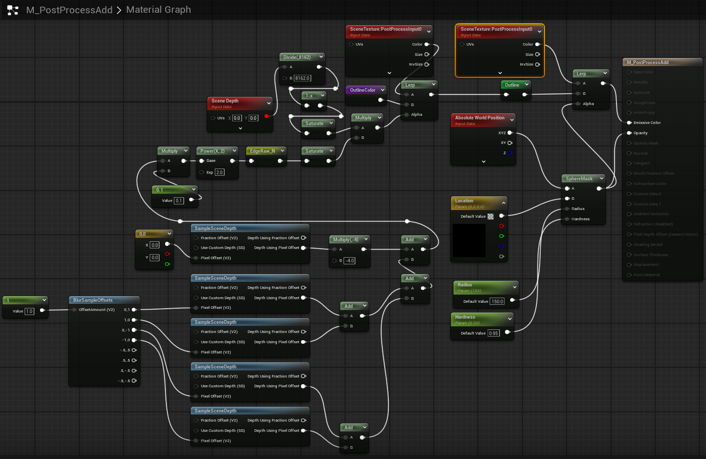
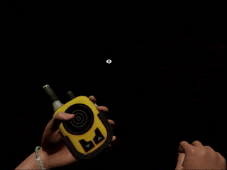
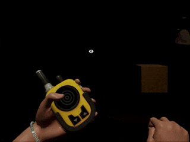

# Echolocation System - Technical Documentation

An Unreal Engine C++ implementation of a sonar-based visual navigation system that reveals objects in dark environments through expanding sound waves.

## 🎮 [Play Demo - Echoes of Stella](https://futuregames.itch.io/echoes-of-stella)

## Overview

This echolocation system creates a sonar mechanic where players emit sound pulses that visually reveal their surroundings through edge detection and outline rendering. The system combines decal-based ground effects with post-process materials to create an immersive navigation experience in low-visibility environments.


*Echolocation revealing environment geometry through edge detection*

## Core Components

### 1. EchoGenerator (Actor)
The primary actor responsible for generating and managing echo effects.

**Key Features:**
- **Dual Visual Systems**: Combines decal components (surface rings) with post-process volumes (object outlines)
- **Timeline-Driven Animation**: Three separate float curves control radius expansion and intensity fading
- **Dynamic Material Parameters**: Real-time updates to color, position, radius, and intensity
- **Performance Optimization**: Static caching of post-process volume reference
- **Customizable Duration**: Overridable fadeout timing via spawn parameters

**Technical Implementation:**
```cpp
// Dynamic material creation and parameter setting
DynPPMat = UMaterialInstanceDynamic::Create(PPMat, this);
DynPPMat->SetVectorParameterValue(TEXT("Center"), GetActorLocation());
DynPPMat->SetScalarParameterValue(TEXT("Radius"), StartRange);

// Timeline-based interpolation
float NewRadius = FMath::Lerp(StartRange, SoundRingRange, Alpha);
```

### 2. BaseEchoPawn (Character)
Player character implementation with Enhanced Input System integration.

**Capabilities:**
- Input binding for sonar activation
- Spawns `EchoGenerator` actors at player position
- Configurable visual properties (color, range)
- Blueprint-extensible design pattern
```cpp
void ABaseEchoPawn::SpawnEcho()
{
    if (AEchoGenerator* Echo = GetWorld()->SpawnActor<AEchoGenerator>(
        EchoGeneratorClass, GetActorTransform(), Params))
    {
        Echo->SetEchoColor(DecalColor);
        Echo->SetSoundRingRange(SoundRingRange);
        Echo->SetOutlineColor(DecalColor);
    }
}
```

## Material System

### Post-Process Material Graph

*Complete post-process material graph showing edge detection and outline rendering*

The post-process material implements:

1. **Scene Depth Sampling**: Multiple depth offsets create edge detection
2. **Custom Stencil Integration**: Identifies specific object types for outlining
3. **Radial Masking**: Sphere-based distance calculations from echo origin
4. **Color Blending**: Lerp operations for smooth color transitions

### Color System Architecture

*Material parameter setup for dynamic color control*

**Special Color Parameter**: Allows dynamic color switching through material parameters
- `OutlineColor`: Defines the primary outline color
- `SpecialColor`: Alternative color channel for gameplay-specific highlighting
- Intensity modulation for fade effects


*Custom stencil switch for handling different object types*

**Custom Stencil Switch**: Material graph branch that handles different stencil values to render specific object types with appropriate colors.

## Timeline System

The system uses three independent float curves:

### 1. Radius Expansion Curve
- **Purpose**: Controls the expanding ring radius from `StartRange` to `SoundRingRange`
- **Interpolation**: Linear interpolation between start and target radius
- **Updates**: Both decal scale and post-process sphere mask

### 2. Post-Process Intensity Curve
- **Purpose**: Modulates the outline visibility strength
- **Effect**: Fades outline effect over time
- **Parameter**: `Intensity` on post-process material

### 3. Decal Intensity Curve
- **Purpose**: Independent fade control for ground decal
- **Benefit**: Allows different timing for surface vs outline effects
- **Parameter**: `Intensity` on decal material

### Fadeout Timeline
- **Trigger**: Starts after decal timeline completes
- **Duration**: Overridable via `FadeoutDuration` property
- **Cleanup**: Destroys actor upon completion

## Use Cases

| Case | Description | Image |
|-------|-------------|-------|
| Echomaker Devices | Can make echoes with certain frequency |  |
| Player Makes Echo | Player can make echo with 3 different levels |  |
| Enemy Makes Echo | Enemy can make echo with different colors |  |
| Throwable Echomaker Objects | There are throwable objects that can make echoes when hit |  |

## Blueprint Integration


*Blueprint node showing exposed spawn parameters*

**Exposed Spawn Parameters:**
- `Fadeout Duration`: Override default fade timing
- `Decal Color`: Visual color of echo effect
- `Outline Color`: Edge highlight color
- `Sound Ring Range`: Maximum echo radius


## Usage Example
```cpp
// In your character class
UPROPERTY(EditAnywhere, Category="Echo")
TSubclassOf<AEchoGenerator> EchoGeneratorClass;

void AMyCharacter::ActivateSonar()
{
    FActorSpawnParameters Params;
    Params.Owner = this;
    
    AEchoGenerator* Echo = GetWorld()->SpawnActor<AEchoGenerator>(
        EchoGeneratorClass, 
        GetActorTransform(), 
        Params
    );
    
    if (Echo)
    {
        Echo->SetEchoColor(FLinearColor::Cyan);
        Echo->SetSoundRingRange(2000.f);
        Echo->FadeoutDuration = 3.0f;
    }
}
```

## Required Assets

### Materials
- `MI_Decal`: Material instance for ground decal
- `PPMat`: Post-process material with edge detection
  
### Curves
- `Curve_Radius`: Float curve for expansion
- `Curve_Intensity`: Float curve for PP fade
- `Curve_IntensityDecal`: Float curve for decal fade
- `Curve_Fadeout`: Float curve for final fade

### Level Setup
- Post-process volume in scene (marked as unbound)

## Blueprint Events

The system exposes two Blueprint implementable events:
```cpp
UFUNCTION(BlueprintImplementableEvent, Category="Echo")
void CE_Expand();  // Called when echo starts expanding

UFUNCTION(BlueprintImplementableEvent, Category="Echo")
void CE_Finish();  // Called before actor destruction
```

Use these for audio cues, particle effects, or gameplay triggers.

## Architecture Highlights

### Component Structure
```
EchoGenerator (AActor)
├── RootComp (USceneComponent)
├── DecalComp (UDecalComponent)
├── Timeline_Decal (UTimelineComponent)
└── Timeline_Fadeout (UTimelineComponent)
```

### Material Parameters
| Parameter | Type | Purpose |
|-----------|------|---------|
| Location | Vector | Echo center position |
| Radius | Scalar | Current echo radius |
| Intensity | Scalar | Visibility strength |
| Color | Vector | Decal tint color |
| EnemyOutlineColor | Vector | Object outline color |

## Gameplay Demo


*Player using echolocation to navigate through dark environment*


## Credits

**Project**: Echoes of Stella - Echolocation Navigation System  
**Engine**: Unreal Engine 5  
**Language**: C++ with Blueprint integration  
**Input System**: Enhanced Input System

---

*This system demonstrates advanced Unreal Engine techniques including timeline animation, dynamic material manipulation, post-process rendering, and component-based architecture design.*
